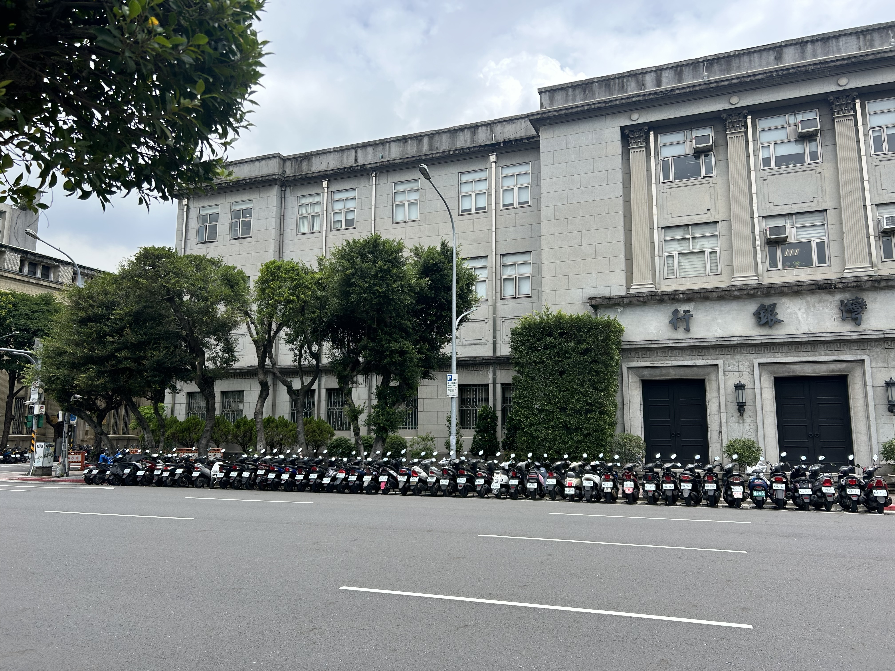
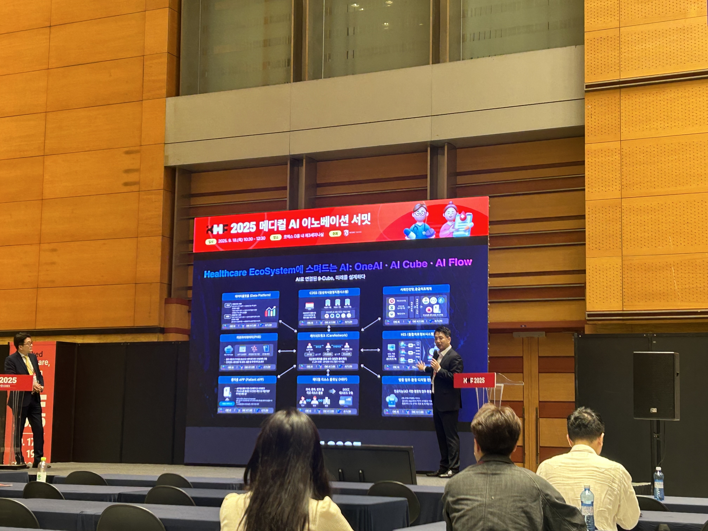
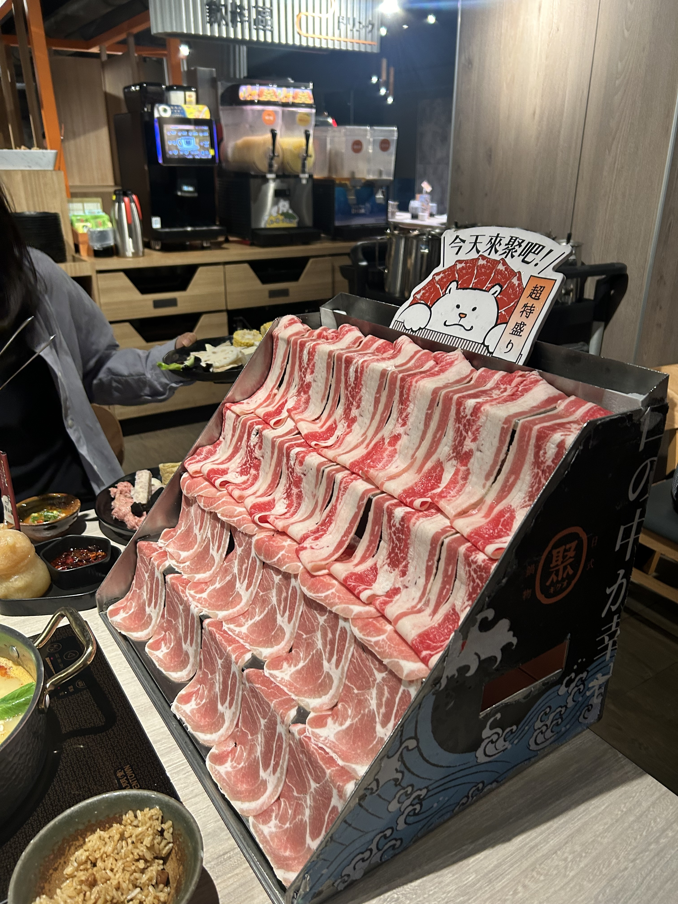
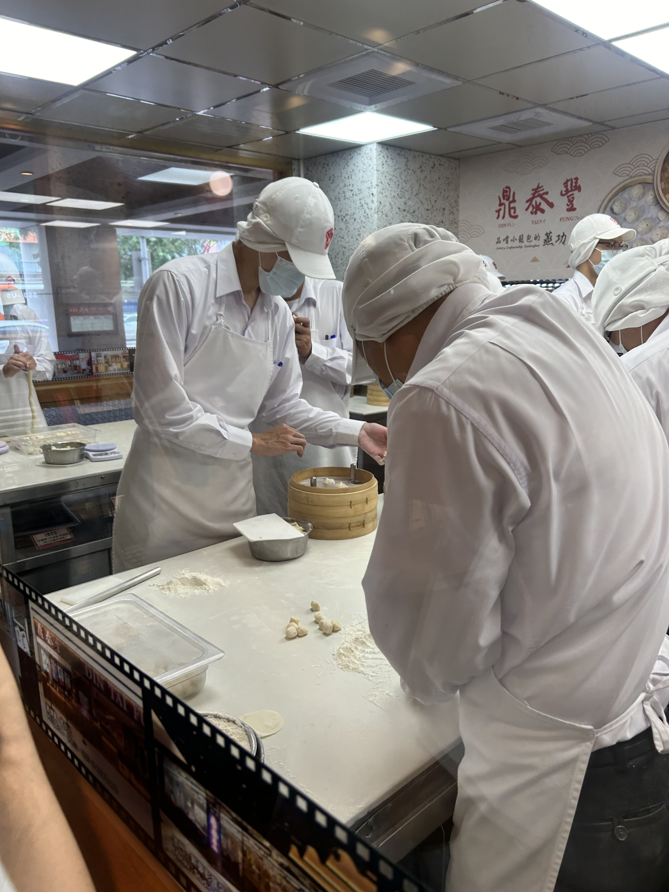

## 문제 1

Q: 다음 이미지에 대한 설명 중 옳지 않은 것은 무엇인가요?
- (1) 도로 옆에 오토바이들이 줄지어 서 있습니다.
- (2) 건물은 클래식한 스타일로 지어져 있습니다.
- (3) 건물 앞에는 작은 나무들이 있습니다.
- (4) 도로 위에 차들이 여러 대 주차되어 있습니다.

Listening: Which of the following descriptions of the image is incorrect?
- (1) There are motorcycles lined up next to the road.
- (2) The building has a classic architectural style.
- (3) There are small trees in front of the building.
- (4) Several cars are parked on the road.

정답: (4) 도로 위에 차들이 아닌 오토바이들이 주차되어 있습니다.

---------------------

## 문제 2

Q: 다음 이미지에 대한 설명 중 옳지 않은 것은 무엇인가요?
- (1) 두 사람은 무대에서 발표를 하고 있습니다.
- (2) 화면에는 "Healthcare EcoSystem"이 소개되어 있습니다.
- (3) 모든 참석자들이 뒤돌아 앉아 있습니다.
- (4) 배경에는 큰 스크린이 설치되어 있습니다.

Listening: Which of the following descriptions of the image is incorrect?
- (1) Two people are giving a presentation on stage.
- (2) The screen introduces the "Healthcare EcoSystem."
- (3) All the attendees are sitting with their backs to the stage.
- (4) There is a large screen set up in the background.

정답: (3) 모든 참석자들이 뒤돌아 앉아 있지는 않습니다.

---------------------

## 문제 3

Q: 다음 이미지에 대한 설명 중 옳지 않은 것은 무엇인가요?
- (1) 음료 기계가 여러 대 보입니다.
- (2) 얇게 썬 고기가 계단식으로 진열되어 있습니다.
- (3) 테이블 위에 여러 가지 음식이 놓여 있습니다.
- (4) 점원이 파란색 유니폼을 입고 있습니다.

Listening: Which of the following descriptions of the image is incorrect?
- (1) Several drink machines are visible.
- (2) Thinly sliced meat is displayed in a tiered manner.
- (3) Various dishes are placed on the table.
- (4) The clerk is wearing a blue uniform.

정답: (4) 사람은 파란색 유니폼을 입고 있는 것이 아닙니다. (보이지 않습니다.)

---------------------

## 문제 4

Q: 다음 이미지에 대한 설명 중 옳지 않은 것은 무엇인가요?
- (1) 요리사들이 모자를 쓰고 있습니다.
- (2) 사람들이 테이블에서 빵을 굽고 있습니다.
- (3) 작업대 위에 밀가루가 뿌려져 있습니다.
- (4) 모든 요리사가 흰색 유니폼을 입고 있습니다.

Listening: Which of the following descriptions of the image is incorrect?
- (1) The chefs are wearing hats.
- (2) People are baking bread on a table.
- (3) There is flour sprinkled on the workbench.
- (4) All chefs are wearing white uniforms.

정답: (2) 사람들이 빵을 굽고 있는 것이 아니라 반죽을 준비하고 있습니다.

---------------------

